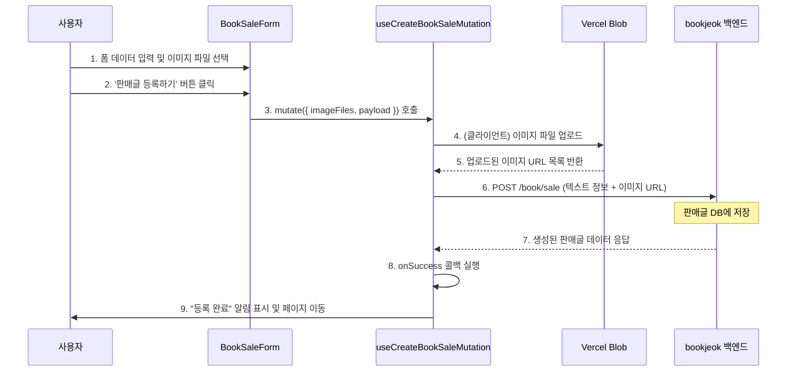
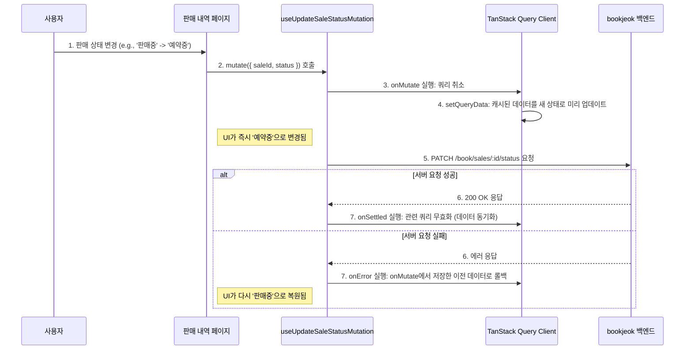

# Book Sale Feature (중고책 판매)

중고책 판매글 관리를 위한 프론트엔드 feature 모듈입니다.

## 폴더 구조

```
book-sale/
├── types.ts          # 타입 정의 (UsedBookSale, SaleStatus, DTOs)
├── apis/index.ts       # API 함수 (CRUD, 검색)
├── queries.tsx       # TanStack Query 훅
├── mutations.tsx     # TanStack Mutation 훅
├── constants.ts      # 상수 (가격 제한, 정렬 기본값, 유효값 검증용 Set)
├── hooks/            # 커스텀 훅
│   ├── use-book-sale-search-params.ts  # URL 파라미터 읽기/쓰기 통합 관리 (유효성 검증 포함)
│   ├── use-user-location.ts            # 위치 권한 관리
│   ├── use-book-sale-form.ts           # 등록 폼 로직 (Headless ImageHook 적용)
│   └── use-book-sale-edit-form.ts      # 수정 폼 로직 (Headless ImageHook 적용)
├── actions/          # Server Actions
│   ├── upload-action.ts    # 이미지 업로드
│   └── delete-action.ts    # 이미지 삭제
└── components/       # Context-Based Grouping
    ├── sale-market/           # 마켓 메인 (필터 + 그리드)
    ├── sale-detail/           # 판매글 상세 페이지
    ├── sale-form/             # 등록/수정 폼
    ├── my-sales/              # 내 판매 내역
    └── common/                # 공통 컴포넌트
```

## 핵심 타입

```typescript
enum SaleStatus {
  FOR_SALE = "FOR_SALE",
  RESERVED = "RESERVED",
  SOLD = "SOLD",
}

interface UsedBookSale {
  id: number;
  title: string;
  price: number;
  city: string;
  district: string;
  content: string;
  imageUrls: string[];
  status: SaleStatus;
  user: SaleAuthor;
  book: BookInfo;
  viewCount: number;
  latitude?: number;
  longitude?: number;
  placeName?: string;
}
```

## 쿼리 훅

| 훅                          | 용도                      |
| --------------------------- | ------------------------- |
| `useInfiniteBookSalesQuery` | 판매글 검색 (무한 스크롤) |
| `useMyBookSalesQuery`       | 내 판매글 목록            |
| `useBookSaleDetailQuery`    | 판매글 상세               |
| `useInfiniteRelatedSalesQuery`| 관련 판매글 (무한 스크롤) |
| `useRelatedSalesQuery`      | 관련 판매글               |
| `useRecentBookSalesQuery`   | 최근 판매글               |
| `usePopularBookSalesQuery`  | 인기 판매글               |

## 뮤테이션 훅

| 훅                                | 용도        |
| --------------------------------- | ----------- |
| `useCreateBookSaleMutation`       | 판매글 등록 |
| `useUpdateBookSaleMutation`       | 판매글 수정 |
| `useUpdateBookSaleStatusMutation` | 상태 변경   |
| `useDeleteBookSaleMutation`       | 판매글 삭제 |

## 의존성

- `@/features/book`: `BookInfo`, `Book` 타입, `useInfiniteBookSearch` 훅
- `@/features/auth`: 사용자 인증 정보

## API 엔드포인트

모든 API는 `/book/...` 경로를 사용합니다 (백엔드 호환성 유지).

## 데이터 흐름 및 핵심 로직

### 중고 서적 판매글 생성 (이미지 업로드 포함)

사용자가 판매글 폼을 작성하고 제출하면, 클라이언트(브라우저)에서 직접 이미지를 Vercel Blob에 업로드한 후, 반환된 이미지 URL을 포함하여 백엔드에 최종 데이터를 전송합니다.



> **💡 아키텍처 노트 (Headless Component)**: 
> 폼 내부의 복잡한 이미지 상태 관리(파일 유효성 검사, URL 미리보기 생성, 개수 초과 관리 등)는 
> 공용 UI(`ImageUploader`)와 결합되지 않고 순수 로직 훅인 `shared/hooks/use-image-upload.ts`로 
> 완전 분리(Headless)되어 관리됩니다. 폼은 이 훅을 호출해 렌더링에 필요한 상태만 내려받아 사용합니다.

### 판매 상태 변경 (낙관적 업데이트)

사용자가 '나의 판매 내역' 페이지에서 판매 상태를 변경하면, 서버 응답을 기다리지 않고 즉시 UI를 업데이트하여 사용자 경험을 향상시킵니다.


