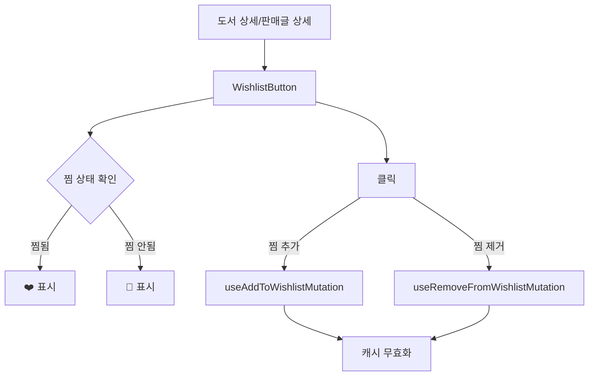

# Frontend Feature: User

프론트엔드의 `user` 기능은 사용자 프로필 관리, 위시리스트, 회원탈퇴 등 사용자 계정 관련 기능을 담당합니다.

## 1. 주요 파일 및 역할

- **`apis/index.ts`**: 백엔드 `/user` 엔드포인트와 통신하는 API 함수들을 정의합니다.
  - `getUserProfile`: 내 프로필 조회
  - `getPublicProfile`: 공개 프로필 조회 (handle 기반)
  - `updateProfile`: 프로필 수정
  - `checkNickname`: 닉네임 중복 검사
  - `getWishlist`: 위시리스트 조회
  - `addToWishlist`: 위시리스트 추가
  - `removeFromWishlist`: 위시리스트 제거
  - `checkWishlistStatus`: 위시리스트 상태 확인
  - `withdraw`: 회원 탈퇴

- **`queries.tsx`**: TanStack Query 쿼리 훅을 정의합니다.
  - `useUserProfileQuery`: 내 프로필 조회
  - `usePublicProfileQuery`: 공개 프로필 조회
  - `useWishlistQuery`: 위시리스트 조회
  - `useWishlistStatusQuery`: 특정 항목 위시리스트 상태 확인

- **`mutations.tsx`**: TanStack Query 뮤테이션 훅을 정의합니다.
  - `useUpdateProfileMutation`: 프로필 수정
  - `useAddToWishlistMutation`: 위시리스트 추가
  - `useRemoveFromWishlistMutation`: 위시리스트 제거
  - `useWithdrawMutation`: 회원 탈퇴

- **`components/`**: 사용자 관련 UI 컴포넌트들
  - `profile-edit-modal/`: 프로필 수정 모달 (닉네임 변경, 이미지 선택/업로드)
  - `user-profile/`: 사용자 프로필 표시
  - `user-stats-dashboard/`: 사용자 통계 대시보드
  - `wishlist-button/`: 위시리스트(찜) 버튼
  - `wishlist-item/`: 위시리스트 아이템
  - `wishlist-list/`: 위시리스트 목록
  - `withdrawal-modal/`: 회원탈퇴 확인 모달

- **`types.ts`**: 사용자 관련 TypeScript 타입 정의

- **`shared/utils/profile-image.ts`**: 프로필 이미지 URL 변환 유틸리티
  - `getProfileImageUrl`: 기본 프로필 식별자를 실제 경로로 변환
  - `isDefaultProfileImage`: 기본 프로필 이미지인지 확인

## 2. 위시리스트 시스템

위시리스트는 두 가지 타입을 지원합니다:

- **BOOK**: 도서 자체를 찜 (ISBN 기반)
- **SALE**: 특정 판매글을 찜

## 3. 공개 프로필

다른 사용자의 프로필 페이지에서 확인할 수 있는 정보:

- 닉네임, 프로필 이미지
- 가입일
- 판매 중인 도서 수, 작성한 리뷰 수
- 최근 리뷰 3개
- 최근 판매글 3개
- 독서 기록 (공개 설정 시)

## 4. 회원탈퇴

회원탈퇴 시 처리되는 항목:

- 사용자 정보 익명화 (닉네임 → "(알수없음)")
- 상품 숨김 처리 (WITHDRAWN)
- 채팅방 참여 비활성화
- 리뷰/리액션/위시리스트/독서기록 삭제
- 댓글 익명화 (userId → null)

## 5. 위시리스트 낙관적 업데이트

위시리스트 토글 시 빠른 UI 반응을 위해 낙관적 업데이트를 적용:

1. 버튼 클릭 시 즉시 UI 상태 변경
2. 백그라운드에서 API 요청
3. 성공 시 관련 쿼리 무효화
4. 실패 시 원래 상태로 롤백
