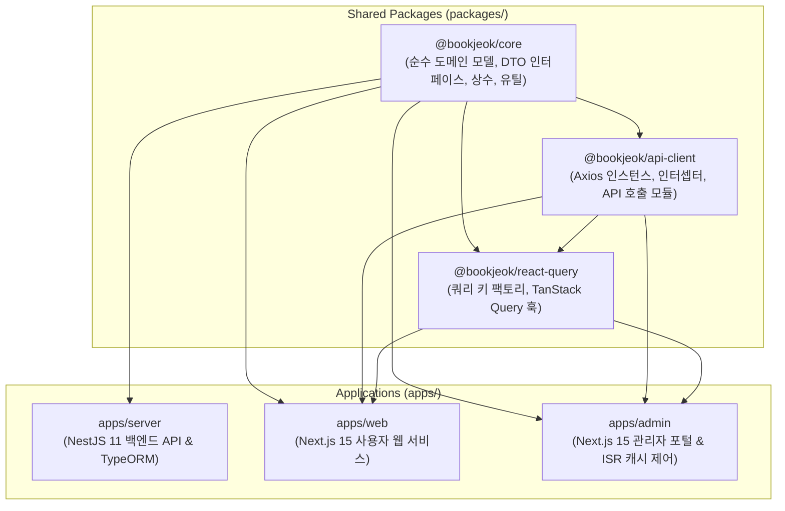
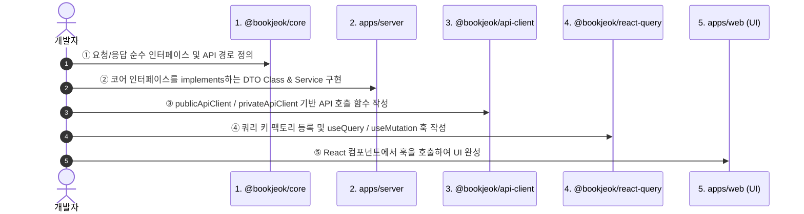

# 북적 (bookjeok) 모노레포 개발 가이드라인

이 문서는 북적 모노레포 프로젝트에 새로 합류한 개발자가 시스템 구조를 빠르게 이해하고, 일관된 아키텍처 규칙에 따라 안전하게 기능을 개발할 수 있도록 작성된 공식 온보딩 가이드입니다.

---

## 1. 모노레포 아키텍처 및 패키지 계층 구조

북적은 **Turborepo + pnpm 워크스페이스** 기반의 계층형 모노레포로 구성되어 있습니다. 각 패키지와 애플리케이션은 명확한 책임과 단방향 의존성 규칙을 가집니다.



### 각 레이어의 역할 및 책임

| 경로 / 패키지 | 역할 및 기술 스택 | 지켜야 할 핵심 규칙 |
| :--- | :--- | :--- |
| **`packages/core`** | 순수 도메인 타입, API 경로 상수, 포맷터 | **런타임 의존성 0B 유지**. 브라우저/Node 전용 라이브러리 임포트 금지 |
| **`packages/api-client`** | Axios 통신 클라이언트, 토큰 인터셉터 | 순수 HTTP 통신 래핑. React Hook이나 상태 관리 코드 포함 금지 |
| **`packages/react-query`** | TanStack Query v5 훅, 쿼리 키 팩토리 | UI 부수 효과(Toast, Router 이동) 금지, 순수 데이터 훅으로 작성 |
| **`apps/server`** | NestJS 11, TypeORM, PostgreSQL + pgvector | **Entity와 Class DTO는 서버 내부에 격리** (`implements` 패턴 적용) |
| **`apps/web`** | Next.js 15 App Router (사용자 웹) | 중복 로컬 타입 금지, `@bookjeok/core` 및 공용 패키지 직접 참조 |
| **`apps/admin`** | Next.js 15 App Router (관리자 웹) | 장터/리뷰 모니터링, 실시간 메트릭, ISR 웹훅 온디맨드 재검증 |

---

## 2. 신규 기능 개발 표준 워크플로우 (Contract-First)

새로운 도메인 기능(예: `Bookmark` 기능)을 추가할 때는 반드시 다음 **5단계 표준 순서**를 따릅니다.



### 단계별 상세 가이드

#### 1단계: `@bookjeok/core`에 순수 계약(Contract) 정의
- `packages/core/src/features/[feature]/types.ts`에 요청 파라미터 및 응답 인터페이스 선언
- `packages/core/src/shared/constants/apis.ts`에 API 엔드포인트 경로 상수 등록
- `packages/core/src/index.ts`에서 export

#### 2단계: `apps/server`에서 DTO 및 백엔드 API 구현
- `apps/server/src/features/[feature]/dtos/`에 NestJS DTO Class 작성 시 코어 인터페이스를 `implements`
  ```typescript
  import { CreateBookmarkParams } from '@bookjeok/core';
  import { IsNotEmpty, IsString } from 'class-validator';

  export class CreateBookmarkDto implements CreateBookmarkParams {
    @IsString()
    @IsNotEmpty()
    bookId: string;
  }
  ```
- Controller, Service, TypeORM Entity 구현 및 Swagger 데코레이터 적용

#### 3단계: `packages/api-client`에 API 통신 함수 추가
- `packages/api-client/src/features/[feature]/apis.ts` 작성
- 비인증 요청은 `publicApiClient`, 인증 필요 요청은 `privateApiClient` 사용

#### 4단계: `packages/react-query`에 쿼리 키 및 훅 작성
- `packages/react-query/src/features/[feature]/queries.ts` 또는 `mutations.ts` 작성
- `@bookjeok/core`의 쿼리 키 팩토리를 참조하여 캐시 무효화(`queryClient.invalidateQueries`) 연동

#### 5단계: `apps/web` / `apps/admin`에서 UI 조립
- 컴포넌트에서 `@bookjeok/react-query` 훅과 `@bookjeok/core` 타입을 직접 임포트하여 화면 구성

---

## 3. 핵심 아키텍처 규칙

### ① Entity & DTO의 서버 격리 원칙 (`implements` 패턴)
- **Entity**: `typeorm` 데코레이터가 붙은 DB 매핑 클래스입니다. 내부 전용 컬럼(`password`, `tokenVersion` 등)이 포함되므로 클라이언트에 절대 노출하지 않습니다.
- **DTO**: `class-validator`, `class-transformer`, `@nestjs/swagger` 데코레이터가 붙은 런타임 클래스입니다. 프론트엔드로 보내면 번들 오염 및 브라우저 호환 에러를 유발하므로 서버 내부에 둡니다.
- **규칙**: `@bookjeok/core`에는 순수 인터페이스만 두고, 서버의 DTO 클래스가 이를 `implements`하여 컴파일 타임 정합성을 보장합니다.

### ② 인증 및 토큰 관리 구조
- **크로스 도메인 환경**: 백엔드와 프론트엔드 배포 도메인이 상이하므로 HttpOnly Cookie 대신 `Authorization: Bearer <token>` 헤더 방식을 사용합니다.
- **1회용 인증 티켓 (Social Login Ticket Exchange)**:
  - 카카오/네이버 소셜 로그인 완료 후 백엔드는 JWT를 URL에 직접 노출하지 않고 60초 유효의 일회용 `ticket`을 발급하여 프론트엔드로 리다이렉트합니다.
  - 프론트엔드는 `POST /auth/exchange`를 호출하여 안전하게 JWT를 발급받습니다.
- **Silent Refresh & 토큰 무효화 (`tokenVersion`)**:
  - `packages/api-client`의 Axios 인터셉터가 Access Token 만료 시 Refresh Token으로 자동 갱신합니다.
  - 로그아웃 또는 보안 무효화 시 백엔드의 `user.tokenVersion`을 증가시켜 이전 Refresh Token을 즉시 무효화합니다.

### ③ 불필요한 중복 타입 및 중간 Re-export 금지
- 로컬 컴포넌트/유틸 파일에서 `export type MyType = CoreType` 같은 단순 별칭이나 징검다리 re-export를 만들지 마세요.
- 원본인 `@bookjeok/core`에서 직접 `import { ... } from '@bookjeok/core'`로 가져옵니다.

---

## 4. 디렉토리 구조 상세

### 프론트엔드 (`apps/web/src/`)
```
src/
├── app/                  # Next.js App Router (다국어 라우트 [locale], 레이아웃, 메타데이터)
├── views/                # 페이지 단위 조립 컴포넌트 ([feature]-view/)
├── features/             # 도메인별 기능 컴포넌트, 상태 스토어
│   └── [feature]/
│       ├── components/   # 문맥 기반 UI 컴포넌트 (list-view/, detail-view/, common/)
│       ├── stores/       # 기능별 Zustand 스토어
│       └── utils/        # 기능별 전용 헬퍼
├── shared/               # 전역 공용 컴포넌트, 스타일, 유틸
│   ├── components/       # Radix UI 기반 공용 컴포넌트
│   ├── providers/        # QueryProvider, UserProvider 등
│   └── utils/            # 전역 UI 유틸리티
└── layouts/              # 전역 헤더, 푸터, 네비게이션 레이아웃
```

### 백엔드 (`apps/server/src/`)
```
src/
├── features/             # 도메인 모듈 (NestJS Modular Architecture)
│   └── [feature]/
│       ├── controllers/  # API 라우트 핸들러
│       ├── services/     # 비즈니스 로직
│       ├── entities/     # TypeORM DB 엔티티
│       └── dtos/         # 유효성 검증 DTO (Core interface implements)
└── shared/               # 전역 가드(JwtAuthGuard, RolesGuard), 필터, 인터셉터
```

---

## 5. 검증 및 빌드 커맨드 가이드

작업 완료 후에는 반드시 루트에서 다음 명령어들을 실행하여 무결성을 검증합니다.

```bash
# 1. 공용 패키지 빌드
pnpm --filter @bookjeok/core build
pnpm --filter @bookjeok/api-client build

# 2. 전체 앱 타입 검사 (에러 0건 확인)
pnpm --filter @bookjeok/server exec tsc --noEmit
pnpm --filter @bookjeok/web exec tsc --noEmit
pnpm --filter @bookjeok/admin exec tsc --noEmit

# 3. 전체 단위 테스트 실행 (100% 통과 확인)
pnpm --filter @bookjeok/server test
pnpm --filter @bookjeok/web test
pnpm --filter @bookjeok/api-client test
```
